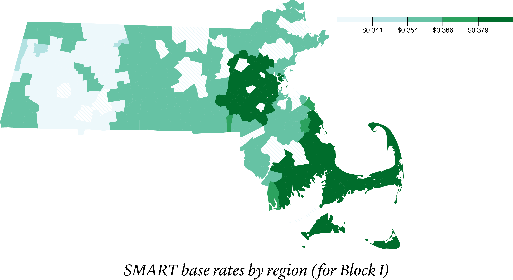

# Making a map



## The challenge

Supposing we have a lookup table of providers and `SMART` rates
```
{
  "WMECo d/b/a Eversource Energy": 0.32862,
  "Massachusetts Electric d/b/a National Grid": 0.35795,
  ...
}
```

and some TopoJSON data
```
{
  "type": "Topology",
  "bbox": [
    ...
  ],
  "transform": {
    ...
  },
  "objects": {
    "towns": {
      ...
    },
    "regions": {
      "type": "GeometryCollection",
      "geometries": [
        {
          "type": "MultiPolygon",
          "arcs": [
            ...
          ],
          "id": "WMECo d/b/a Eversource Energy",
          "properties": {
            "ELEC_LABEL": "WMECo d/b/a Eversource Energy"
          }
        },
        {
          "type": "MultiPolygon",
          "arcs": [
            ...
          ],
          "id": "Massachusetts Electric d/b/a National Grid",
          "properties": {
            "ELEC_LABEL": "Massachusetts Electric d/b/a National Grid"
          }
        },
        ...
      ]
    }
  }
}
```

We want to update the `properties` field of each element in the deeply-nested `geometries` array. Desired result would look like
```diff
{
  ...
  "objects": {
    ...
    "regions": {
      ...
      "geometries": [
        {
          ...
          "properties": {
            "ELEC_LABEL": "WMECo d/b/a Eversource Energy",
+           "SMART": 0.32862
          }
        },
        {
          ...
          "properties": {
            "ELEC_LABEL": "Massachusetts Electric d/b/a National Grid",
+           "SMART": 0.35795
          }
        },
        ...
      ]
    }
  }
}
```

## Possible solutions

### Using mutation

```js
geoData.objects.towns.geometries.forEach(
  (g, i) =>
    (geoData.objects.towns.geometries[i] = {
      ...g,
      properties: {
        ...g.properties,
        rate: g.properties.ELEC_LABEL.split(", ").map(
          label => lookUpTable[label] || 0
        )
      }
    })
)
```
